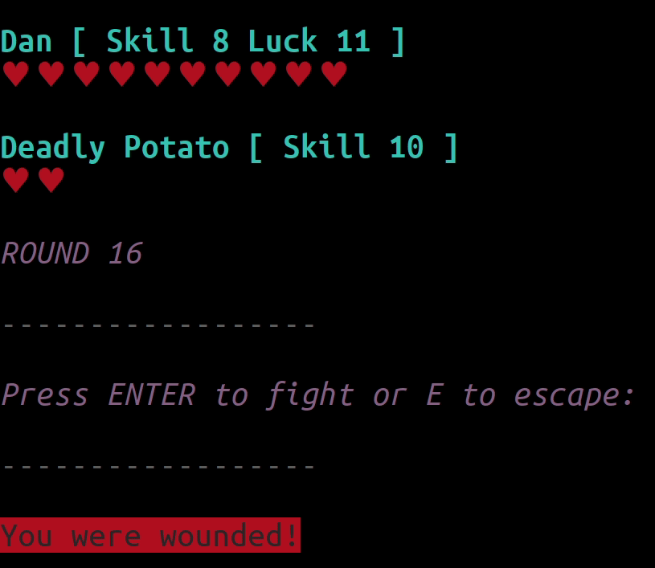

# fighting-fantasy-fighter

__node cli app for running Fighting Fantasy monster battles__

I found a copy of [The Citadel of Chaos](https://en.wikipedia.org/wiki/The_Citadel_of_Chaos) in our local [Little Free Library](https://littlefreelibrary.org/) box and took it home for my son.

I can remember, at his age, finding the monster battle process tedious, so I made this app.

He has not yet used it tbh but that's not a reflection of my work.

## Features

* Optional automated character / monster stat rolls
* Features ability to use Luck
* Dwindling hearts display the current state of the battle
* Flashing hearts indicate low health warning

## Usage

* `npm run install`
* `node fighting-fantasy-fighter`
* Follow the prompts
* Fight!
