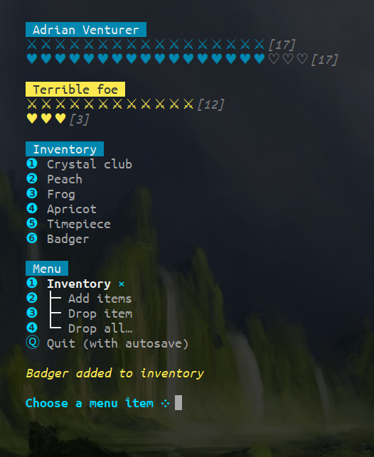

# fighting-fantasy-fighter

__node command line companion app for playing Fighting Fantasy books__

After playing [The Citadel of Chaos](https://en.wikipedia.org/wiki/The_Citadel_of_Chaos) many times with my son I became slightly obsessed with the idea of making a cli app to help us manage our playthroughs.

He has not yet used it tbh but that's not a reflection of my work! I’m waiting for a couple of new books to be delivered.

## Features

* Simple menu driven interface
* Manage player attributes & inventory
* Exciting ASCII dice graphics
* Gripping creature battles with a running log of your conquests
* Add / remove inventory items
* Save multiple snapshots of current game state
* Export / import entire game state to json
* Requires a [Fighting Fantasy](https://www.fightingfantasy.com/) book

[Try it online here](https://repl.it/@danfarrow/fighting-fantasy-fighter)

## Usage

* Requires `node` & `npm`
* `npm run install` to install dependencies
* `npm link` to create a global link
* `fff` to run
* Choose menu items by typing the corresponding number

Note: I've only used this on Ubuntu Linux. If you try it on another system please let me know what happens!

## Coming soon

* Add / edit custom game rules
* Simpler inventory management
* Friendlier export interface
* More thrillingness
